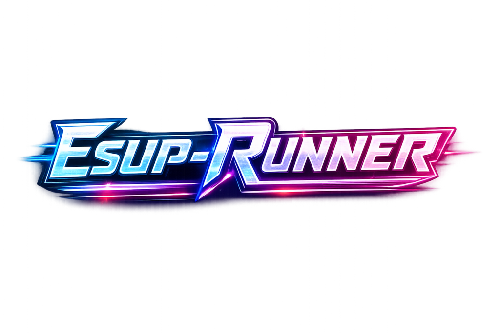

# ESUP-Runner

<h1 align="center">
  
   
   

  
  
  
  
  
  
  
  
</h1>

This GitHub repository contains **two distinct Python projects**:

- **Manager**: orchestration/admin service (source + packaging in `manager/`)
- **Runner**: execution agent/service (source + packaging in `runner/`)

Each project has its own `pyproject.toml`, documentation, release process, etc.

## Documentation

### Manager

- Docs home: [manager/docs/README.md](manager/docs/README.md)
- Installation: [manager/docs/INSTALLATION.md](manager/docs/INSTALLATION.md)
- Docker installation: [manager/docs/DOCKER.md](manager/docs/DOCKER.md)
- Upgrade: [manager/docs/UPGRADE.md](manager/docs/UPGRADE.md)
- Configuration: [manager/docs/CONFIGURATION.md](manager/docs/CONFIGURATION.md)
- Parameters: [manager/docs/PARAMETERS.md](manager/docs/PARAMETERS.md)
- Changelog: [manager/docs/CHANGELOG.md](manager/docs/CHANGELOG.md)
- Versioning: [manager/docs/VERSION_MANAGEMENT.md](manager/docs/VERSION_MANAGEMENT.md)

### Runner

- Docs home: [runner/docs/README.md](runner/docs/README.md)
- Installation: [runner/docs/INSTALLATION.md](runner/docs/INSTALLATION.md)
- Docker installation: [runner/docs/DOCKER.md](runner/docs/DOCKER.md)
- Upgrade: [runner/docs/UPGRADE.md](runner/docs/UPGRADE.md)
- Configuration: [runner/docs/CONFIGURATION.md](runner/docs/CONFIGURATION.md)
- Parameters: [runner/docs/PARAMETERS.md](runner/docs/PARAMETERS.md)
- Changelog: [runner/docs/CHANGELOG.md](runner/docs/CHANGELOG.md)
- Versioning: [runner/docs/VERSION_MANAGEMENT.md](runner/docs/VERSION_MANAGEMENT.md)

## License

This repository is licensed under the GPL-3.0 license. See [LICENSE](LICENSE).
