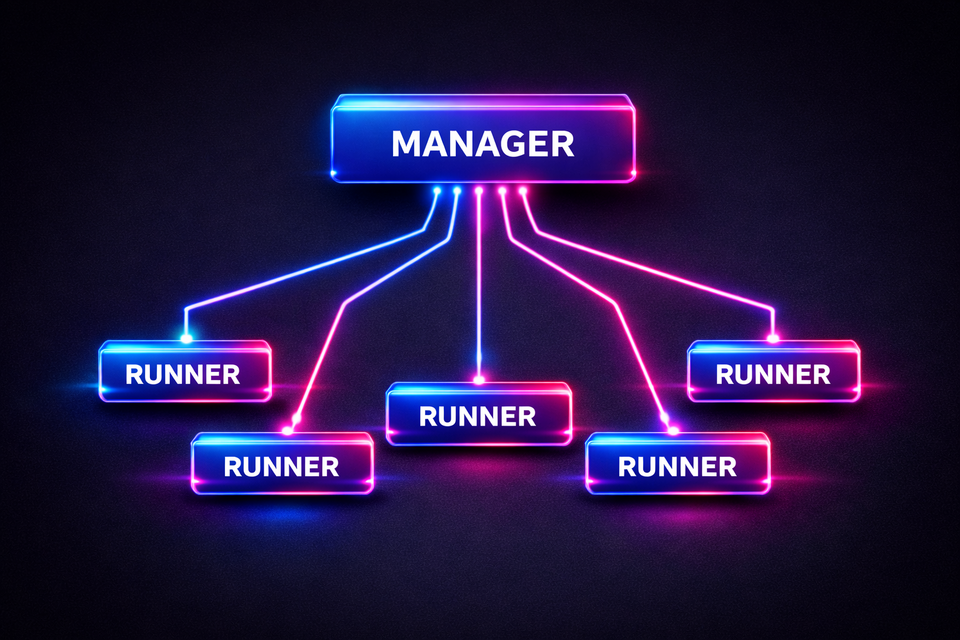

# ESUP Runner Manager

<p align="center">
	
</p>

ESUP Runner Manager is the central service that orchestrates a pool of distributed runners.
Client applications submit tasks to the manager, the manager selects an eligible runner, and then proxies status/results back to clients.

This folder contains the manager documentation.

## Installation

See [INSTALLATION.md](INSTALLATION.md).

## Upgrading

See [UPGRADE.md](UPGRADE.md).

### Quick install (Ubuntu/Debian)

```bash
# 1) Create a dedicated user
sudo adduser esup-runner
sudo adduser esup-runner sudo

# 2) Install base packages
sudo apt update
sudo apt install -y curl ca-certificates git make

# 3) Install uv (as esup-runner)
su - esup-runner
curl -LsSf https://astral.sh/uv/install.sh | sh

# 4) Fetch sources
sudo mkdir -p /opt/esup-runner
sudo chown esup-runner:esup-runner /opt/esup-runner/

cd /opt/esup-runner
git clone --filter=blob:none --sparse https://github.com/EsupPortail/esup-runner.git .
# Only manager
git sparse-checkout set manager
# To install **both** the runner and the manager
# git sparse-checkout set manager runner
cd manager

# 5) Configure
cp .env.example .env
nano .env

# 6) Install Python dependencies
make sync

# 7) Initialize directories and install the systemd service (as root)
sudo make init
sudo make create-service
```

## What the manager does

At a high level, the manager:

- Maintains an in-memory registry of runners (with heartbeats) and tasks.
- Accepts task submissions (`POST /task/execute`) from client applications.
- Selects the first runner that is:
	- reachable (`GET {runner.url}/runner/ping`),
	- `available` and `registered`,
	- and advertises support for the requested `task_type`.
- Calls the runner to start execution (`POST {runner.url}/task/run`).
- Receives completion notifications from runners (`POST /task/completion`).
- Optionally notifies the client application back via `notify_url`.
- Exposes an admin dashboard (`/admin`) and API endpoints for status/results.

## Authentication and version compatibility

### Client → Manager (task submission, polling, result download)

Manager API endpoints use token-based auth:

- Send either `Authorization: Bearer <token>` or `X-API-Token: <token>`.
- Tokens must match one of the configured `AUTHORIZED_TOKENS__*` environment variables.

### Runner → Manager (register / heartbeat / completion)

Runners also authenticate using the same token mechanism.

Additionally, runner registration and heartbeat require the header:

- `X-Runner-Version: <runner_version>`

The manager enforces that the runner MAJOR and MINOR versions match the manager MAJOR and MINOR versions.

### Manager → Runner (run / result streaming)

When the manager calls a runner, it uses the token captured at runner registration.

- `Authorization: Bearer <RUNNER_TOKEN>`

This is the same token the runner used to call `POST /runner/register`.

## Task lifecycle

1. **Client submits a task** to the manager via `POST /task/execute`.
2. **Manager selects an eligible runner** by calling `GET {runner.url}/runner/ping`.
3. **Manager starts the task** on that runner via `POST {runner.url}/task/run`.
4. **Runner executes** the job and writes outputs.
5. **Runner notifies completion** back to the manager via `POST /task/completion`.
6. **Client retrieves status/results** from the manager:
	 - Status: `GET /task/status/{task_id}`
	 - Manifest: `GET /task/result/{task_id}`
	 - Files: `GET /task/result/{task_id}/file/{file_path}`

Notes:

- If `RUNNERS_STORAGE_ENABLED` is set, the manager reads manifests/files from shared storage.
- Otherwise, the manager proxy-streams results from the runner.
- If a `notify_url` is configured for the task, the manager performs a callback when it receives completion.

## Client API: submitting tasks to the manager

Clients submit a task request to `POST /task/execute`.

Headers:

```http
Accept: application/json
Authorization: Bearer <CLIENT_TOKEN>
```

Payload (`TaskRequest`):

```json
{
	"etab_name": "My institution",
	"app_name": "My app",
	"app_version": "4.0.0",
	"task_type": "encoding",
	"source_url": "https://example.org/input.mp4",
	"affiliation": "staff",
	"parameters": {},
	"notify_url": "https://client.example.org/runner_manager_webhook"
}
```

Examples by task type:

### Client example: `encoding`

```json
{
	"etab_name": "University Video Platform",
	"app_name": "Esup-Pod",
	"app_version": "4.0.0",
	"task_type": "encoding",
	"source_url": "https://video.example.org/media/video.mp4",
	"notify_url": "https://pod.example.org/api/runner_manager_webhook/",
	"parameters": {
		"rendition": {
			"360": "640x360",
			"720": "1280x720",
			"1080": "1920x1080"
		}
	}
}
```

### Client example: `studio`

```json
{
	"etab_name": "University Video Platform",
	"app_name": "Esup-Pod",
	"app_version": "4.0.0",
	"task_type": "studio",
	"source_url": "https://video.example.org/media/opencast-files/abcd-efgh/abcd-efgh.xml",
	"notify_url": "",
	"parameters": {}
}
```

### Client example: `transcription`

```json
{
	"etab_name": "University Video Platform",
	"app_name": "Esup-Pod",
	"app_version": "4.0.0",
	"task_type": "transcription",
	"source_url": "https://video.example.org/media/audio-or-video.mp4",
	"notify_url": "https://pod.example.org/api/runner_manager_webhook/",
	"parameters": {
		"language": "fr",
		"output_formats": ["vtt", "srt", "txt"],
		"diarization": false
	}
}
```

## Runner API: calls performed by the manager

The manager expects runners to expose at least the following endpoints.

### `GET /runner/ping` (manager → runner)

Used for runner selection. The manager requires this JSON shape:

```json
{
	"available": true,
	"registered": true,
	"task_types": ["encoding", "studio", "transcription"]
}
```

### `POST /task/run` (manager → runner)

The manager starts a task by POSTing a JSON payload to the selected runner.

Headers:

```http
Accept: application/json
Authorization: Bearer <RUNNER_TOKEN>
```

Common JSON envelope (forwarded from the client `TaskRequest`, with extra fields added by the manager):

```json
{
	"task_id": "2f53b18a-1c09-4cdb-b31d-6a68f3e6a761",
	"etab_name": "My institution",
	"app_name": "My app",
	"app_version": "4.0.0",
	"task_type": "encoding",
	"source_url": "https://example.org/input.mp4",
	"affiliation": "staff",
	"parameters": {},
	"notify_url": "https://client.example.org/runner_manager_webhook",
	"completion_callback": "https://manager.example.org/task/completion"
}
```

The `parameters` object is **task-type specific** and is interpreted by the runner implementation (the manager does not validate it).

#### Example: `task_type = "encoding"`

```json
{
	"task_id": "2f53b18a-1c09-4cdb-b31d-6a68f3e6a761",
	"etab_name": "University Video Platform",
	"app_name": "Esup-Pod",
	"app_version": "4.0.0",
	"task_type": "encoding",
	"source_url": "https://video.example.org/media/video.mp4",
	"affiliation": "staff",
	"notify_url": "https://pod.example.org/api/runner_manager_webhook/",
	"completion_callback": "https://manager.example.org/task/completion",
	"parameters": {
		"rendition": {
			"360": "640x360",
			"720": "1280x720",
			"1080": "1920x1080"
		}
	}
}
```

#### Example: `task_type = "studio"`

```json
{
	"task_id": "2f53b18a-1c09-4cdb-b31d-6a68f3e6a761",
	"etab_name": "University Video Platform",
	"app_name": "Esup-Pod",
	"app_version": "4.0.0",
	"task_type": "studio",
	"source_url": "https://video.example.org/media/opencast-files/abcd-efgh/abcd-efgh.xml",
	"affiliation": "staff",
	"notify_url": "https://pod.example.org/api/runner_manager_webhook/",
	"completion_callback": "https://manager.example.org/task/completion",
	"parameters": {}
}
```

#### Example: `task_type = "transcription"`

```json
{
	"task_id": "2f53b18a-1c09-4cdb-b31d-6a68f3e6a761",
	"etab_name": "University Video Platform",
	"app_name": "Esup-Pod",
	"app_version": "4.0.0",
	"task_type": "transcription",
	"source_url": "https://video.example.org/media/audio-or-video.mp4",
	"affiliation": "staff",
	"notify_url": "https://pod.example.org/api/runner_manager_webhook/",
	"completion_callback": "https://manager.example.org/task/completion",
	"parameters": {
		"language": "fr",
		"output_formats": ["vtt", "srt", "txt"],
		"diarization": false
	}
}
```

### `GET /task/result/{task_id}` and `GET /task/result/{task_id}/file/{file_path}` (manager → runner)

When shared storage is disabled, the manager proxy-streams from the runner using:

```http
Accept: application/json          # for the manifest
Accept: application/octet-stream  # for a file
Authorization: Bearer <RUNNER_TOKEN>
```

The runner should return:

- a JSON manifest describing produced files (commonly `manifest.json`),
- and binary streams for requested files.

## Manager API: callbacks and client-facing endpoints

### `POST /task/completion` (runner → manager)

The runner must notify the manager using the token it used to register.

Headers:

```http
Accept: application/json
Authorization: Bearer <RUNNER_TOKEN>
```

Payload:

```json
{
	"task_id": "2f53b18a-1c09-4cdb-b31d-6a68f3e6a761",
	"status": "completed",
	"error_message": null,
	"script_output": "ffmpeg finished successfully"
}
```

Valid completion statuses: `completed`, `warning`, `failed`.

### Optional: notify callback (manager → client app)

If the original task request has a non-empty `notify_url`, the manager POSTs:

```json
{
	"task_id": "2f53b18a-1c09-4cdb-b31d-6a68f3e6a761",
	"status": "completed",
	"script_output": "..."
}
```

## Admin dashboard

- `/admin` provides a web UI (HTTP Basic auth).
- `/tasks` provides task browsing/search.

## Diagrams

- `architecture.png` gives an overview of components.
- `tree.png` shows the repository structure.

## License

Licence LGPL 3.0
