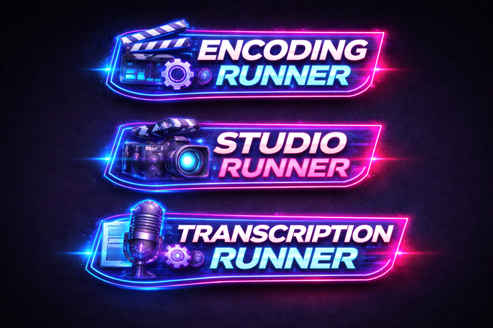

# Runner Overview

<p align="center">
    
</p>

This README explains what the runner service does, how it is started, and the task types it can execute.

## Installation

See [INSTALLATION.md](INSTALLATION.md).

## Upgrading

See [UPGRADE.md](UPGRADE.md).

### Quick install (Ubuntu/Debian)

```bash
# 1) Create a dedicated user
sudo adduser esup-runner
sudo adduser esup-runner sudo

# 2) Install base packages
sudo apt update
sudo apt install -y curl ca-certificates git make time ffmpeg

# Optional (only if you hit FFmpeg/PNG fallbacks that require ImageMagick)
# sudo apt install -y imagemagick

# 3) Install uv (as esup-runner)
su - esup-runner
curl -LsSf https://astral.sh/uv/install.sh | sh

# 4) Fetch sources
sudo mkdir -p /opt/esup-runner
sudo chown esup-runner:esup-runner /opt/esup-runner/

cd /opt/esup-runner
git clone --filter=blob:none --sparse https://github.com/EsupPortail/esup-runner.git .
# Only runner
git sparse-checkout set runner
# To install **both** the runner and the manager
# git sparse-checkout set manager runner
cd runner

# 5) Configure
cp .env.example .env
nano .env

# 6) Install Python dependencies
# Default encoding or studio tasks
make sync
# With transcription tasks on CPU-only server, use:
# make sync-transcription-cpu
# With transcription tasks on GPU server, use:
# make sync-transcription-gpu

# 7) Initialize directories and install the systemd service
sudo make init
sudo make create-service
```

## What the runner is
- A FastAPI service that receives tasks from the Manager, downloads required media, executes processing scripts, and pushes results back.
- Each runtime process is an "instance"; multi-instance mode lets you spread different task types across processes.
- Instances auto-register themselves with the Manager on startup and expose a small health/ping API.

## High-level lifecycle
1) Launcher starts one or more runner instances (FastAPI + Uvicorn). Instance ID and port are derived from configuration.
2) On startup the instance registers with the Manager, advertising which task types it supports.
3) The Manager POSTs tasks to the runner. The runner picks the right handler for the task type.
4) The handler downloads inputs into an isolated workspace, runs the appropriate script, stores outputs and logs, and writes metadata for the task.
5) Completion status is reported back to the Manager; background services keep storage tidy and can monitor instances.

## Configuring instances and task types
- Configuration is driven by environment variables parsed in [app/core/config.py](../app/core/config.py).
- Legacy syntax: set `RUNNER_INSTANCES` and a simple CSV for `RUNNER_TASK_TYPES`; every instance handles the same types.
- Grouped syntax: set only `RUNNER_TASK_TYPES` with groups like `[2x(encoding,studio,transcription),1x(encoding,studio),1x(transcription)]`; the total instance count is inferred and per-instance task sets are expanded accordingly.
- Base ports and URLs are derived from `RUNNER_PROTOCOL`, `RUNNER_HOST`, and `RUNNER_BASE_PORT`; the launcher offsets ports per instance.
- The `RUNNER_TOKEN` secures calls between the runner and the Manager; set it to a non-default value.

## Authentication and version compatibility (Runner  Manager)

When the Runner calls the Manager (registration / heartbeat), it authenticates and sends its version:

- `Authorization: Bearer <RUNNER_TOKEN>`
- `X-Runner-Version: <runner_version>`

The Manager enforces **version compatibility at MAJOR + MINOR level**.
In other words, a runner `0.9.x` can register only to a manager `0.9.y`.

## Supported task types
The runner ships with three handlers (see [app/task_handlers](../app/task_handlers)):

### Encoding (`encoding`)
- Handler: [app/task_handlers/encoding/encoding_handler.py](../app/task_handlers/encoding/encoding_handler.py)
- Purpose: download a media file, then invoke the FFmpeg-based encoding script to produce renditions, thumbnails, audio tracks, and metadata.
- Inputs: media URL plus optional parameters such as `rendition`, `cut`, and `dressing`. Cut JSON format is documented in [docs/TYPE_ENCODING.md](TYPE_ENCODING.md).
- CPU/GPU: honors `ENCODING_TYPE` and GPU-specific env vars for hwaccel.

### Studio (`studio`)
- Handler: [app/task_handlers/studio/studio_handler.py](../app/task_handlers/studio/studio_handler.py)
- Purpose: two-stage workflow. First, generate a base MP4 from a Mediapackage XML (with optional SMIL cut/layout) via the studio script; second, run the standard encoding pipeline on that base video.
- Resilience: if GPU mode fails and `force_cpu` is not set, it retries generation on CPU before failing.
- Parameters: accepts presenter/layout overrides, plus any encoding parameters passed through to the second stage.

### Transcription (`transcription`)
- Handler: [app/task_handlers/transcription/transcription_handler.py](../app/task_handlers/transcription/transcription_handler.py)
- Purpose: run the FFmpeg whisper filter to generate subtitles from audio/video, then package outputs (VTT by default, SRT optional) and metadata.
- Parameters: `language`, `format` (vtt|srt), `model` (small|medium|large|turbo), `normalize` (audio pre-normalization toggle). GPU use follows `ENCODING_TYPE`.

## How tasks are processed
- Each handler inherits from [app/task_handlers/base_handler.py](../app/task_handlers/base_handler.py), which manages workspaces, downloads, input validation, and metadata writing.
- Workspaces live under the storage manager base path; outputs and logs are written to an `output/` subfolder with a `task_metadata.json` summary.
- Result manifests are written to `<STORAGE_DIR>/<task_id>/manifest.json`.
- External scripts are executed with timeouts and inherit environment variables (CUDA hints are injected automatically when GPU mode is enabled). The timeout is controlled by `EXTERNAL_SCRIPT_TIMEOUT_SECONDS` (default `18000`).
- The runner enforces basic safety checks: media extension validation, optional max file size, and non-blocking FFmpeg build warnings for missing codecs/features.

## Minimal .env example
```properties
RUNNER_PROTOCOL=http
RUNNER_HOST=127.0.0.1
RUNNER_BASE_PORT=8082
RUNNER_BASE_NAME=my-runner
RUNNER_TASK_TYPES=[2x(encoding,studio,transcription)]
RUNNER_TOKEN=change-me-runner-token
STORAGE_DIR=/tmp/esup-runner/storage
EXTERNAL_SCRIPT_TIMEOUT_SECONDS=18000
ENCODING_TYPE=CPU
LOG_DIRECTORY=/var/log/esup-runner
LOG_LEVEL=INFO
```

## Additional references
- Installation: [docs/INSTALLATION.md](INSTALLATION.md)
- FFmpeg GPU setup: [docs/FFMPEG_SETUP.md](FFMPEG_SETUP.md)
- Upgrading: [UPGRADE.md](UPGRADE.md)
- Task type docs: [docs/TYPE_ENCODING.md](TYPE_ENCODING.md), [docs/TYPE_STUDIO.md](TYPE_STUDIO.md), [docs/TYPE_TRANSCRIPTION.md](TYPE_TRANSCRIPTION.md)
- Full parameter reference: [docs/RUNNER_PARAMETERS.md](RUNNER_PARAMETERS.md)
- Runner configuration details: [docs/RUNNER_CONFIGURATION.md](RUNNER_CONFIGURATION.md)
- Version management: [docs/VERSION_MANAGEMENT.md](VERSION_MANAGEMENT.md)
- OpenAPI docs are exposed at `/docs` when a runner instance is running.
